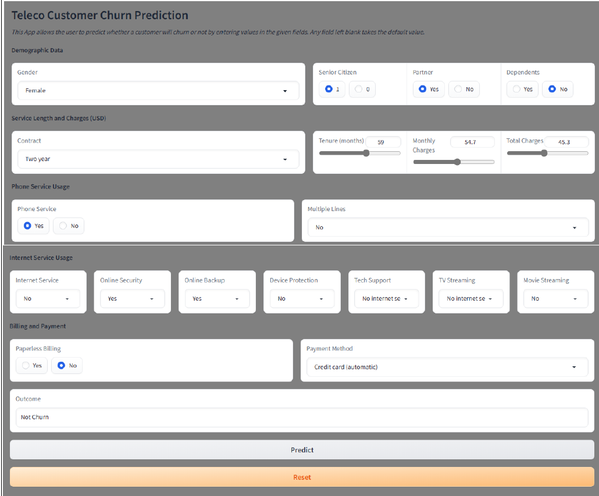

# Building Machine Learning Applications With Gradio ✨

📚 **Description**
=================

Welcome to Building Machine Learning Applications With Gradio! This project is designed to embed a machine learning file into an app for users. It's uses a previously trained Logistic Regression model for customer churn prediction.

📖 **Table of Contents**
=================
- Installation
- Usage
- Authors
- Acknowledgement
- contact

🔧 **Installation**
-----------------
To get started , follow these installation steps:
```bash
# setup the environment on windows by running the following code.
python -m venv venv; venv\Scripts\activate; python -m pip install -q --upgrade pip; python -m pip install -r requirements.txt  

#On Linux
python3 -m venv venv; source venv/bin/activate; python -m pip install -q --upgrade pip; python -m pip install -r requirements.txt 

```
The Two commands are of the same structure
1.Activate the python environment
2.Upgrade pip to it current version
3.install the requirements located in requirements.txt: You should be at the root of your env


🚀 **Usage**
-----------------
To see how the app works, follow these instructions:
1.After setting up enviroment,activatig the environment, and installing requirments,type
```bash
py src/App.py #in the terminal
```
This will open the App in your browser

**Sample user interface**



NB: The machine learning file is stored as pipe.pkl which conatains a pipeline of data transforms up to the regression model

👥 **Authors**
=================

This project is developed and maintained by:
- Sylvester Junior Ampomah
- Jacob Jaroya 🚀
- Kinsley Yaw Asiedu ⭐️
- Felix kiprotich 💡
Feel free to reach out to us with any questions or feedback!

✨ **Acknowledgments**
=================

We would like to express our gratitude to The Azubi Africa team for their valuable contributions to this project.

📞 **Contact**
=================

For any questions, concerns, or suggestions regarding  this project, please contact us at sylvesterjnr87@gmail.com.
